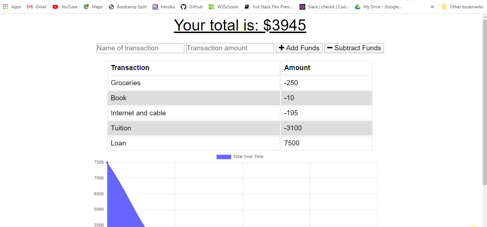

# progressive-budget
PWA online/offline budget tracker.

Added functionality to an existing Budget Tracker application to allow for offline access and functionality.

The user will be able to add expenses and deposits to their budget with or without a connection. Transactions that are entered while offline are saved in IndexedDB. Those transactions will be loaded into the primary MongoDB when online access is re-established.

## Business Context

Giving users a fast and easy way to track their money is important, but allowing them to access that information anytime is even more important. Having offline functionality is paramount to our applications success.

## GitHub

code: https://github.com/JimGreasley/progressive-budget

published at: https://jimgreasley.github.io/progressive-budget/

## Heroku

https://cherry-crumble-30053.herokuapp.com/

## Screen image:

